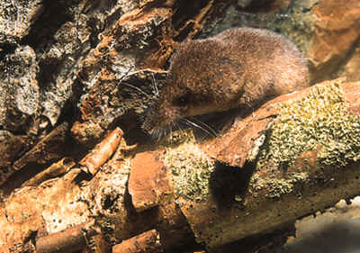

```{r setup, include=FALSE}
knitr::opts_chunk$set(echo = TRUE)
```

There are a number of large public databases that can be useful for macroecological analyses. We will begin with a few that will be useful for species distribution modelling. But before we start, remember to install any packages you don't have on your computer with `install.packages("package_name")`.

## 1. Point occurrence records

We will use the [Global Biodiversity Information Facility](https://www.gbif.org/) (GBIF) to access species occurrence records. This is an open database of worldwide occurrences of species from all taxonomic groups. We can use the `rgbif` package to interact with the database directly from R.

```{r, message = FALSE}
# here is a list of packages you need for this exercise
library(rgbif)
library(maptools)
library(sf)
library(CoordinateCleaner)
library(ggplot2)
library(fasterize)
library(raster)
```


```{r, message = FALSE}
## How many occurrences recorded in Austria?
occ_count(country="AT")
## you can get the ISO codes for other countries with this variable:
## isocodes
```


```{r, message = FALSE}
## GBIF has many kinds of occurrence records. Here we ask for species that were observed (i.e., no specimen was taken)
occ_count(country="AT", basisOfRecord = "OBSERVATION")

```


### 1.1 Downloading records

We will use *Sorex alpinus*, the alpine shrew, as an example taxon for this exercise. The alpine shrew can be uncommonly found in Tirol, and is listed as near threatened by the [IUCN](https://www.iucnredlist.org/species/29660/9514588).



Before looking up a species in GBIF, it's a good idea to check for synonyms:

```{r syn}
(tkey <- name_suggest(q='Sorex alpinus', rank='species'))
```

This indicates only one known name, so we proceed with a record search.


```{r shrew}
occ_count(taxonKey = tkey$data$key)
shrew = occ_search(taxonKey = tkey$data$key, limit=800)$data

## remove NA coordinates
shrew = subset(shrew, !is.na(decimalLatitude))

## this is a very large table, so we just check a piece of it
head(shrew[,1:10])
```

### 1.2 Data cleaning

GBIF is a public database, so it's not uncommon to find incorrect records. It's important therefore to start by checking for and removing any obvious problems. One of the easiest ways is to plot the data on a map. Later, we will also download an expert-drawn range map and compare it to the occurrences.


```{r map}
data(wrld_simpl)
wrld_simpl_sf = st_as_sf(wrld_simpl)
shrew_sf = st_as_sf(shrew, coords = c("decimalLongitude", "decimalLatitude"), crs = 4326)

ggplot(wrld_simpl_sf) + 
	geom_sf(colour='black', fill='white') + xlim(c(5,130)) + ylim(c(20,60)) + 
	geom_sf(data = shrew_sf, col='red')


```

One record looks suspicious; our shrew probably does not occur in Inner Mongolia. But there are many other ways that GBIF records can be less precise than we want. For example, the location precision field tells us how well the location is known for each record; we may want to remove records that are not very precise.


```{r precision}
## get a histogram of the range of location precision, in km, and tally the number of NAs
hist(shrew$coordinateUncertaintyInMeters/1000, main = "", xlab="Location uncertainty (km)")
legend("topright", legend = paste("NA Count:", sum(is.na(shrew$coordinateUncertaintyInMeters))))
```

Some have uncertainties of thousands of km's! Lets view the histogram for only relatively precise locations.

```{r precision2}
## get a histogram of the range of location precision, in km, and tally the number of NAs
hist(subset(shrew, coordinateUncertaintyInMeters <= 50000)$coordinateUncertaintyInMeters/1000, 
	 main = "", xlab="Location uncertainty (km)", breaks=20)
legend("topright", legend = paste("NA Count:", sum(is.na(shrew$coordinateUncertaintyInMeters))))
```

Let's drop all records with uncertainties greater than 10 km. We will keep the NAs, because we aren't sure what this means, but dropping them is also a rational choice. Additionally, there are many old records. Because we will use contemporary climate to model the species' range, we should remove old records to avoid bias in areas with rapidly changing climate.

```{r precision3}
shrew = subset(shrew, is.na(coordinateUncertaintyInMeters) | coordinateUncertaintyInMeters < 10*1000)
shrew = subset(shrew, year > 1970)
```


There are many other manual checks we could do, and we could try to delete points by hand this way. But a better approach is to use workflows created by experts. So we will use the function `clean_coordinates()` from the [CoordinateCleaner package](https://cran.r-project.org/web/packages/CoordinateCleaner/index.html). We run a number of checks here. Take a moment to think about th e logic of these checks. Other checks can be viewed in the help using `?clean_coordinates`.

* `capitals`: Are coordinates within 5000 m of national capitals?
* `centroids`: Within 1000 m of country centroids?
* `institutions`: Within 100 m of a known biodiversity institute?
* `outliers`: Looks for extreme geographic outliers

```{r clean}
shrew_clean = clean_coordinates(shrew, lon="decimalLongitude", lat="decimalLatitude", capitals_rad = 5000,
								countries="countryCode", tests=c("capitals", "centroids", "institutions", "outliers"))

```


```{r map2}
shrew_sf = st_as_sf(shrew, coords = c("decimalLongitude", "decimalLatitude"), crs = 4326)
shrew_sf$status = ifelse(shrew_clean$.summary, "ok", "flagged")
wmap = ggplot(wrld_simpl_sf) + 
	geom_sf(colour='black', fill='white') + xlim(c(5,130)) + ylim(c(20,60))  + xlab("") + ylab("")

wmap + geom_sf(data = shrew_sf, aes(colour = status))
```

The outlier in China is flagged, but all other records seem ok, so we remove the outlier and proceed.

```{r delete}
shrew = shrew[shrew_clean$.summary,]
shrew_sf = st_as_sf(shrew, coords = c("decimalLongitude", "decimalLatitude"), crs = 4326)

wmap = ggplot(wrld_simpl_sf) + 
	geom_sf(colour='black', fill='white') + xlim(c(5,27)) + ylim(c(40,55))  + xlab("") + ylab("")
wmap + geom_sf(data = shrew_sf, colour="#00BFC4", size=0.7)
```

The help files and vignettes for CoordinateCleaner detail other issues that can be found using GBIF data, and are worth a read, as is the methods paper where they describe in detail how to go about cleaning the data (see `citation('CoordinateCleaner')`).

## 2. Range Maps

Point data are helpful for describing specific occurrences of a species, but they often come with biases (e.g., there may be many more records in easily accessible places). Thus, we often also need to rely on maps drawn by experts. The IUCN makes such maps available for free (https://www.iucnredlist.org/resources/spatial-data-download), and there are many other such sources online. Access to data is provided for approved reasons; our data is available for you from the instructor. I have saved it in the "data" folder inside my working directory.

```{r iucn_map}
shrew_range = readRDS("../data/sorex.rds")
wmap_r = wmap + geom_sf(data = shrew_range, colour = "#aa1308", fill="#F8766D", alpha=0.5)
(wmap_rp <- wmap_r + geom_sf(data = shrew_sf, colour="#00BFC4", size=0.7))
```

For the current exercise, we are mostly interested in viewing the locations with respect to the expert-derived range maps. However, we often want to do some analyses with these programs. Here we can practise some code that we will use later on.

### 2.1 Producing raster maps

We use the excellent `fasterize` package to produce a raster from our range map. Note that the `fasterize()` function works similarly to the `rasterize()` function from the `raster` package, but, as the name implies, is usually much faster.

First we must create a template raster that tells us at what resolution we want our raster map to be in. The problem is that it is unclear at which spatial resolution the range maps accurately represent species occurrences. Hurlbert and Jetz (2007) and Jetz, et al (2012) define the minimum spatial resolution as 100-200km (1-2°), although also resolutions of 50km (0.5°) and finer have been used (Krosby et al. 2015). We will use a (relatively fine) resolution of 10 arcminutes to allow us to intersect the raster range map with climate data.


```{r fasterize}

## Create a template raster
template = raster(extent(shrew_range), resolution = 1/6, crs = crs(shrew_sf))
shrew_range_r = fasterize(shrew_range, template)

## change it to a point file just for plotting
shrew_range_pts = as.data.frame(rasterToPoints(shrew_range_r))
colnames(shrew_range_pts) = c("x", "y", "val")

wmap_r + geom_tile(data = shrew_range_pts, aes(x=x, y=y), fill = "#619CFF", alpha = 0.5, show.legend = FALSE)
```

### 2.1 Range size

Many analyses deal with range sizes. We might naively compute the sum of all of the cells in our raster; however this presents a problem. Why is this? Think about the projection of the data:

```{r crs}
crs(shrew_range_r)
```

What is the area of one cell?

There are a number of easy functions we can use to compute the area correctly, either from the original polygons or from the raster. Here we compute it from both, converting from square meters to square kilometers in the process

```{r area}
## First with polygons
area_m2 = sum(st_area(shrew_range)) ## sum because there are multiple polygons
units::set_units(area_m2, "km^2")

## next with raster
## we must remove NAs, otherwise we get only the area of the entire square raster
sum(values(area(shrew_range_r, na.rm = TRUE)), na.rm=TRUE) 
```

**Notice that the two results are very close, but not identical. Why is this?**

### 2.2 Centroids

Centroids are useful for computing the "average" location of the species. Note that it is entirely possible for this to be located in inappropriate habitat or outside of the range! These can be useful, for example, if one wants to ask, "how far north will a species migrate in response to climate change?"

Note that centroids don't make sense for latitude/longitude data; the length of one degree is not constant! So we must project our data; here we use the Lambert Equal Area Conic projection (epsg:3035), which is useful and recommended for spatial analyses in continental Europe.

```{r centroid}

shrew_proj = st_transform(shrew_range, crs=3035)

## Combine all polygons into one
shrew_proj = st_union(shrew_proj)

## This gives us a single point, which we convert back to latitude/longitude
ctr = st_transform(st_centroid(shrew_proj), crs=crs(shrew_range))
wmap_rp + geom_sf(data = ctr, size=4)
```

## 3 Climate Data

If we want to mdoel the range as a function of climate, we also need to aquire spatial climate data. There are a number of sources for this; we will use the tried-and-true [WorldClim](http://worldclim.org/) dataset, which we can access directly from the `raster` package. However, there are newer datasets available; in particular the [Chelsa Climate Dataset](https://chelsa-climate.org) is quite good and freely available. There is an R-pacakge in development called [ChelsaDL](https://github.com/matthewkling/chelsaDL) that gives you access to these data directly from R.

We will use the [bioclim](https://www.worldclim.org/data/bioclim.html) climate variables for our analysis; be sure to read over the link for information on what these variables represent and why they are useful in SDM applications. We get 19 (!) variables in bioclim. Note that the Chelsea dataset [provides even more bioclim variables](https://chelsa-climate.org/bioclim/).

```{r bioclim}
## make sure the directory exists
path = "../data/clim"
dir.create(path, showWarnings = FALSE)
clim = getData("worldclim", var="bio", res=10, download=T, path=path)
plot(clim)
```

We have already set the appropriate resolution using the `res` argument. However, the `raster` package provides a lot of functions that are useful for manipulating these data in case we need to change resolutions, extents, etc. It is useful to browse the help for these to know they are available:

* `?resample`
* `?aggregate`
* `?crop`
* `?extend`

### 3.1 Joining (intersecting) occurrence and climate data

We now have two sources of information on the distribution of the alpine shrew, the occurrences from GBIF (`shrew_sf`) and the range map in both polygon (`shrew_range`) or raster (`shrew_range_r`) format. We can use functions in the raster package to get the climate values for either all of the points, or all of the cells in the raster.

```{r intersect}

## first for the GBIF points
shrew_sf = cbind(shrew_sf, extract(clim, shrew_sf))
head(shrew_sf[, grep("bio", colnames(shrew_sf))])

## Here, for example, are the points, coloured by bio1, which is the mean annual temperature
## Note that bioclim is stored as an integer, meaning that the temperature values are in units of 1/10 degree
wmap + geom_sf(data = shrew_range, colour = "#aa1308", fill="white", alpha=0.4) + 
	geom_sf(data = shrew_sf, aes(colour = bio1), size=0.7) + 
	labs(colour = "Mean Annual Temperature (°C×10)") + scale_color_viridis_c(option = "magma")
```

We can also intersect the rasters if we want climate variables for the range polygons. Here we intersect `bio18`, which is the precipitation during the warmest quarter. Why might this be a sensible variable for this organism?

```{r intersect_poly}
range_18 = intersect(shrew_range_r, clim$bio18)

## first we must make sure that the bioclim variable we want has the same extent as the raster for the range
bio18 = resample(clim$bio18, shrew_range_r)

## this works because bio18 holds the values for precip, shrew_range_r is either 1 (for inside the range) or
## NA (for outside the range); the result hold precip values for inside the range, NA otherwise
range_18 = shrew_range_r * bio18
range_18_pts = as.data.frame(rasterToPoints(range_18))
colnames(range_18_pts) = c("x", "y", "bio18")
wmap + geom_tile(data = range_18_pts, aes(x=x, y=y, fill=bio18), alpha = 0.8) + scale_fill_viridis_c(direction=-1)
```


## References

Hurlbert, Allen H., and Walter Jetz. 2007. “Species Richness, Hotspots, and the Scale Dependence of Range Maps in Ecology and Conservation.” PNAS 104: 13384–9.

Jetz, Walter, Jana M. McPherson, and Robert P. Guralnick. 2012. “Integrating Biodiversity Distribution Knowledge: Toward a Global Map of Life.” Trends in Ecology & Evolution 27: 151–59.

Krosby, Meade, Chad B. Wilsey, Jenny L. McGuire, Jennifer M. Duggan, Theresa M. Nogeire, Julie A. Heinrichs, Joshua J. Tewksbury, and Joshua J. Lawler. 2015. “Climate-Induced Range Overlap Among Closely Related Species.” Nature Climate 


<br/><br/><br/>
<p style="font-size:small">Modified with thanks from [Damaris Zurell](https://damariszurell.github.io/HU-GCIB/), [CC-BY 4.0](http://creativecommons.org/licenses/by/4.0/)</p>

